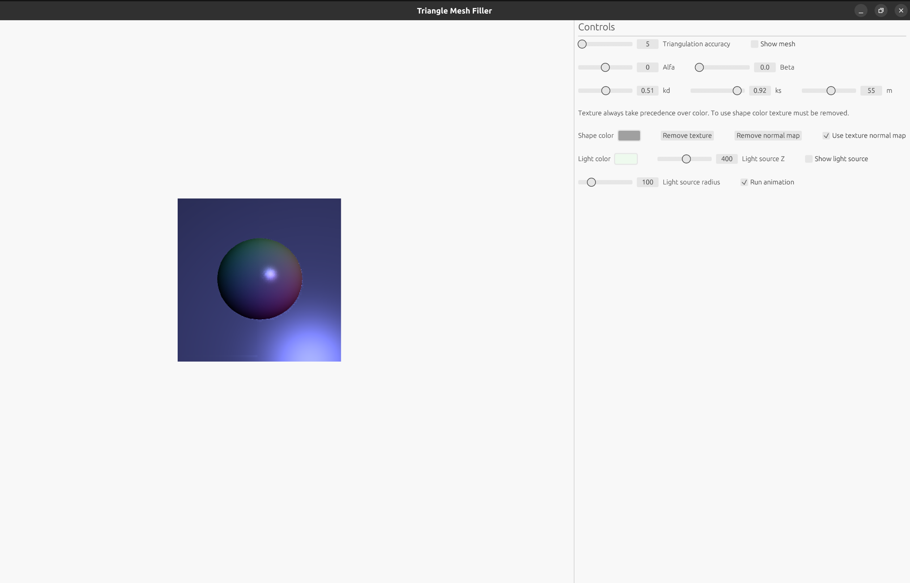
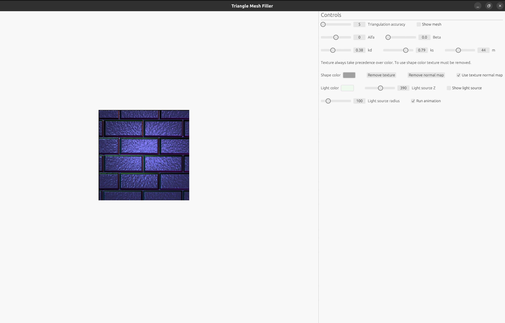
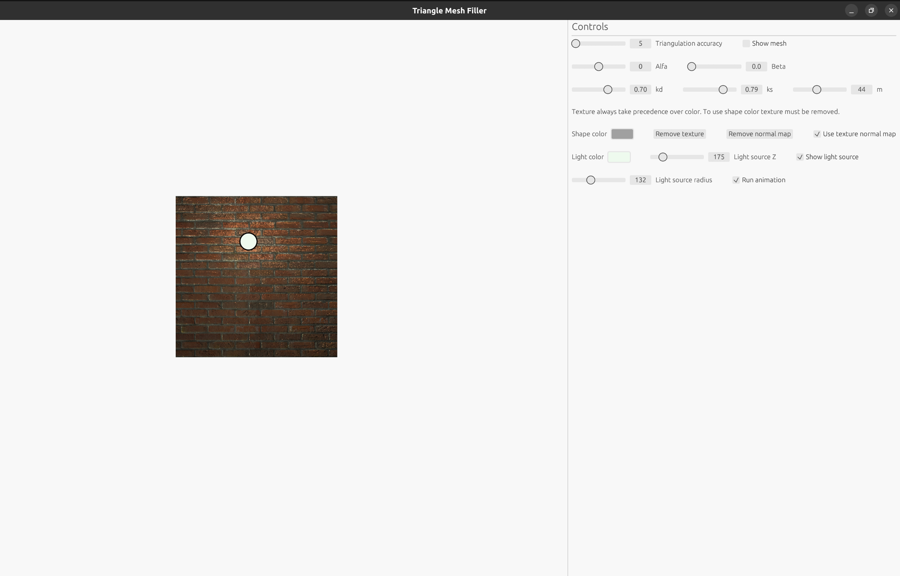
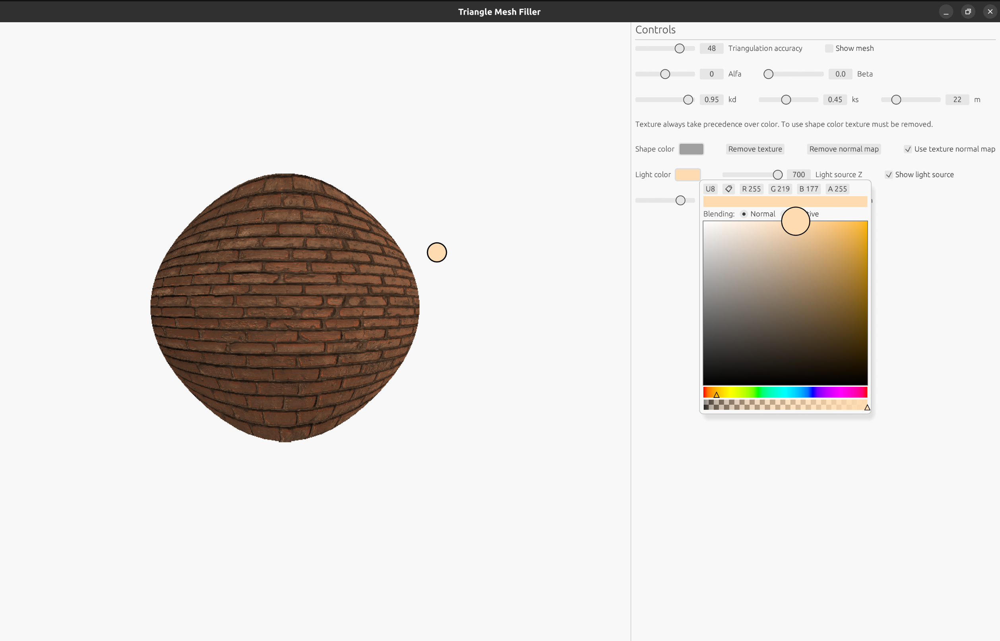
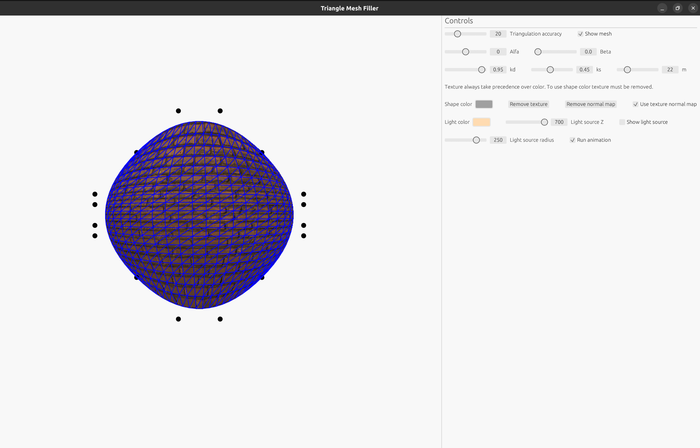

# Triangle Mesh Filler

Triangle Mesh Filler is a GUI app made with egui for "Computer Graphics 1" course.
Its main goal is to simulate a light source going over a user-defined [Bezier Surface](https://en.wikipedia.org/wiki/B%C3%A9zier_surface). The user can change the surface and light colors, load textures and normal maps onto the surface, and modify the parameters of the light source.

The camera is positioned along the Z-axis, meaning we observe the surface from above. The camera moves along a circular path at a constant Z-coordinate. It is recommended that the Z-values of all control points remain below the camera's Z-coordinate.

Examples of textures and normal maps can be found in the `textures` and `normal_maps` directories.

## Running

### Prerequisites
 - rust >= `1.81`

Enter project's root directory and run
```
cargo run --release [CONFIG]
```

where `CONFIG` is the path to a file containing Bézier surface control points. If no file is specified, the default configuration file located at `config/default_config.txt` is used. 

Each configuration file must define exactly 16 control points. Each line in the file should have the format:
```
x_{i} y_{i} z_{i}  
```
This indicates that the `i-th` line corresponds to the `i-th` control point in 3D space (R^3).

Examples of configuration files are available in the `config` directory.

## Examples





